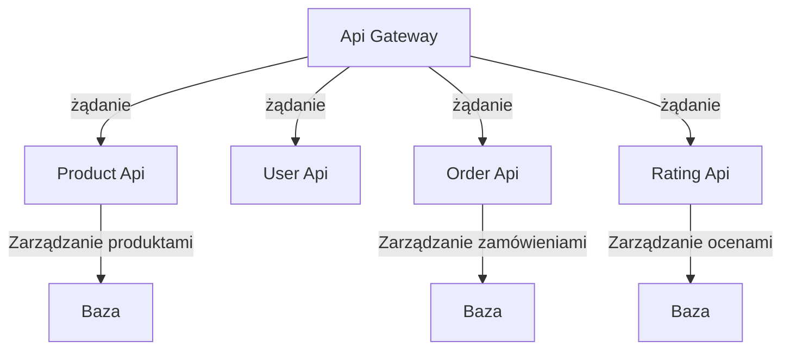

# Microservices kubernetes shop

## Opis projektu

Projekt `microservices-kubernetes-shop` to aplikacja składająca się z serwisów mikroserwisowych zbudowanych z użyciem technologii .NET, Docker i Kubernetes. Celem projektu jest zapewnienie skalowalnej i elastycznej architektury, która umożliwia łatwe zarządzanie poszczególnymi komponentami aplikacji e-commerce.

## Spis treści

- [Wykorzystane technologie](#wykorzystane-technologie)
- [Baza danych](#baza-danych)
- [Autoryzacja](#autoryzacja)
- [Struktura plików](#struktura-plików)
- [Opis serwisów](#opis-serwisów)
  - [Api Gateway](#api-gateway)
  - [Product Api](#product-api)
  - [User Api](#user-api)
  - [Order Api](#order-api)
  - [Rating Api](#rating-api)
- [Kubernetes](#kubernetes)
  - [Deployments](#deployments)
  - [Services](#services)
  - [Load Balancer](#load-balancer)
  - [ConfigMaps](#configmaps)
- [Docker](#docker)
- [Health checks](#health-checks)
- [Zaimplementowane funkcjonalności](#zaimplementowane-funkcjonalności)

## Wykorzystane technologie

- [.NET 8](https://dotnet.microsoft.com/download/dotnet)
- [Docker](https://www.docker.com/)
- [Kubernetes](https://kubernetes.io/)
- [YARP](https://microsoft.github.io/reverse-proxy)
- [MongoDb Atlas](https://www.mongodb.com/cloud/atlas)

## Baza danych

Projekt wykorzystuje bazę danych MongoDB do przechowywania danych. Baza danych jest hostowana w chmurze na platformie MongoDB Atlas. W celu połączenia się z bazą danych, należy skonfigurować odpowiednie parametry połączenia w pliku `appsettings.json` każdego serwisu lub w przypadku kubernetes w pliku `microservices-config.yaml`.

```json
{
  "MongoSettings": {
    "ConnectionString": "mongodb+srv://<username>:<password>@<cluster-url>/<database>?retryWrites=true&w=majority",
    "Database": "MicroservicesApp"
  }
}
```

## Autoryzacja

Projekt wykorzystuje autoryzację JWT do uwierzytelniania użytkowników. Aby uzyskać dostęp do chronionych zasobów, należy przekazać token JWT w nagłówku `Authorization` zgodnie z poniższym schematem:

`Authorization: Bearer [token]`

## Struktura plików

```plaintext
├── ShopMicroservices.sln <-- plik solucji
├── docker-compose.yml <-- plik konfiguracyjny Docker Compose
├── kubernetes <-- folder z plikami konfiguracyjnymi Kubernetes
├── readme.md <-- plik z opisem projektu
├── requests <-- folder z przykładowymi zapytaniami HTTP
└── src
    ├── Api.Gateway <-- serwis bramki API
    ├── Order.Api <-- serwis zamówień
    ├── Product.Api <-- serwis produktów
    ├── Rating.Api <-- serwis ocen
    └── User.Api <-- serwis użytkowników
```

## Opis serwisów

Projekt składa się z kilku serwisów, z których każdy odpowiada za określone zadanie. Poniżej znajduje się lista serwisów wraz z opisem ich funkcjonalności.



### Api Gateway

Bramka API jest punktem wejścia do aplikacji i zarządza ruchem sieciowym między klientem a serwisami mikroserwisów. Odpowiada za przekierowywanie żądań do odpowiednich serwisów oraz agregację odpowiedzi.

Przekierowanie żądań do odpowiednich serwisów odbywa się na podstawie ścieżki URL oraz metody HTTP. Bramka API obsługuje również uwierzytelnianie i autoryzację użytkowników.

Aktualnie bramka API obsługuje następujące ścieżki:

- `/api/products` - serwis produktów
- `/api/users` - serwis użytkowników
- `/api/orders` - serwis zamówień
- `/api/ratings` - serwis ocen

Aby wykonać zapytanie do wskazanego serwisu należy użyć odpowiedniej ścieżki URL oraz metody HTTP według poniższego schematu:

`[ŻĄDANIE] [adres-bramki]/api/[nazwa-serwisu]/[ścieżka-do-endpointu]`

Przykład:

`GET [adres-bramki]/api/products/search`

Bramka wykorzystuje pakiet nuget `Yarp.ReverseProxy` do przekierowywania żądań do odpowiednich serwisów.

Konfiguracja bramki API znajduje się w pliku `appsettings.json`.

### Product Api

Serwis produktów odpowiada za zarządzanie produktami w sklepie internetowym. Umożliwia dodawanie, usuwanie, edytowanie oraz przeglądanie produktów.

Endpointy serwisu produktów:

- `GET /` - zwraca listę wszystkich produktów
- `POST /` - dodaje nowy produkt
- `PUT /` - aktualizuje produkt
- `DELETE /` - usuwa produkt
- `GET /search` - wyszukuje produkty po wskazanych kryteriach

### User Api

Serwis użytkowników odpowiada za zarządzanie użytkownikami w sklepie internetowym. Umożliwia rejestrację, logowanie oraz wysyłanie powiadomienia do użytkownika.

Endpointy serwisu użytkowników:

- `POST /register` - rejestracja nowego użytkownika
- `POST /login` - logowanie użytkownika
- `POST /notify` - wysyłanie powiadomienia do użytkownika

### Order Api

Serwis zamówień odpowiada za zarządzanie zamówieniami w sklepie internetowym. Umożliwia składanie nowych zamówień, przeglądanie zamówień oraz aktualizację statusu zamówienia.

Endpointy serwisu zamówień:

- `POST /cart/{productCode}` - dodaje produkt do koszyka
- `DELETE /cart/{productCode}` - usuwa produkt z koszyka
- `POST /cart/submit` - składa zamówienie
- `POST /cart/cancel` - anuluje zamówienie
- `GET /cart` - zwraca listę wszystkich zamówień dla zalogowanego użytkownika
- `GET /cart/{orderId}` - zwraca szczegóły zamówienia

### Rating Api

Serwis ocen odpowiada za zarządzanie ocenami produktów w sklepie internetowym. Umożliwia dodawanie nowych ocen, przeglądanie ocen oraz obliczanie średniej oceny produktu.

Endpointy serwisu ocen:

- `POST /{productCode}/review` - dodaje nową ocenę produktu
- `DELETE /{productCode}/review` - usuwa ocenę produktu
- `GET /{productCode}/review` - zwraca listę wszystkich ocen produktu

## Kubernetes

Projekt wykorzystuje platformę Kubernetes do zarządzania kontenerami Docker. W folderze `kubernetes` znajdują się pliki konfiguracyjne Kubernetes, które definiują zasoby klastra Kubernetes, takie jak:

- Deployment
- Service
- Load Balancer
- ConfigMap

### Deployments

Do udostępnienia mikroserwisów w klastrze Kubernetes wykorzystano obiekty `Deployment`. Każdy serwis mikroserwisu jest uruchamiany jako oddzielny `Deployment` z określoną liczbą replik.

Obiekty `Deployment` zawierają również informacje o konfiguracji mikroserwisu .NET, np. port, zmienne środowiskowe, obrazy kontenerów Docker.

### Services

Do udostępnienia mikroserwisów w klastrze Kubernetes wykorzystano obiekty `Service`. Każdy serwis mikroserwisu jest uruchamiany jako oddzielny `Service` z określoną konfiguracją dostępu.

Serwisy Kubernetes umożliwiają komunikację między serwisami w klastrze oraz zewnętrznymi klientami. Każdy serwis ma przypisany unikalny adres IP oraz port, który jest dostępny z poziomu innych serwisów w klastrze. Dzięki temu serwisy mogą komunikować się ze sobą bezpośrednio po nazwie, bez konieczności ujawniania swoich adresów IP.

### Load Balancer

Do udostępnienia bramki API w klastrze Kubernetes wykorzystano obiekt `LoadBalancer`. Obiekt `LoadBalancer` umożliwia przekierowanie ruchu sieciowego z zewnętrznej sieci na serwis w klastrze Kubernetes.

Obiekt `LoadBalancer` automatycznie tworzy zasób Load Balancer w chmurze, który przekierowuje ruch sieciowy na serwis w klastrze Kubernetes. Dzięki temu serwis jest dostępny z zewnętrznej sieci pod stałym adresem IP. W przypadku lokalnego uruchomienia będzie to adres `localhost`.

### ConfigMaps

Do przechowywania konfiguracji mikroserwisów w klastrze Kubernetes wykorzystano obiekty `ConfigMap`. Obiekty `ConfigMap` umożliwiają przechowywanie konfiguracji mikroserwisów w postaci kluczy i wartości.

Konfiguracja mikroserwisów jest przechowywana w pliku `microservices-config.yml` w folderze `kubernetes`. Plik ten zawiera konfigurację dostępu do bazy danych oraz klucze JWT.

Przykład wykorzystania w obiekcie `deployment`:

```yaml
    spec:
      containers:
          volumeMounts:
            - name: appsettings-production-volume
              mountPath: /app/appsettings.Production.json
              subPath: appsettings.Production.json
      volumes:
        - name: appsettings-production-volume
          configMap:
            name: microservices-config
```

Konfiguracja bramki API jest przechowywana w pliku `gateway-config.yml` w folderze `kubernetes`. Plik ten zawiera konfigurację Reverse Proxy, która przekierowuje żądania do odpowiednich serwisów mikroserwisów.

Przykład wykorzystania w obiekcie `deployment`:

```yaml
    spec:
      containers:
          volumeMounts:
            - name: appsettings-production-gateway-volume
              mountPath: /app/appsettings.Production.json
              subPath: appsettings.Production.json
      volumes:
        - name: appsettings-production-gateway-volume
          configMap:
            name: gateway-config

```

ConfigMapy są przekazywana do mikroserwisów jako zmienne środowiskowe.

Dzięki obiektom `ConfigMap` konfiguracja mikroserwisów jest zcentralizowana i łatwo zarządzalna.

## Docker

Do konteneryzacji serwisów mikroserwisów wykorzystano technologię Docker. Każdy serwis ma zdefiniowany plik `Dockerfile`, który zawiera instrukcje do zbudowania obrazu kontenera Docker.

## Health checks

Do sprawdzania stanu serwisów mikroserwisów wykorzystano mechanizm health checks. Health checks umożliwiają sprawdzenie, czy serwis jest dostępny i działa poprawnie.

Health checks są realizowane za pomocą endpointu `/healthz` w każdym serwisie mikroserwisu. Endpoint `/healthz` zwraca status HTTP 200 OK, jeśli serwis jest dostępny.

Dodatkowo dodany został dashboard HealthChecks UI, który umożliwia monitorowanie stanu serwisów mikroserwisów w czasie rzeczywistym. Został wykorzystany do tego pakiet `AspNetCore.HealthChecks.UI` oraz jego operator dla środowiska Kubernetes.
[Link do dokumentacji](https://github.com/Xabaril/AspNetCore.Diagnostics.HealthChecks/blob/master/doc/k8s-operator.md).

Został on bezpośrednio udostępniony jako zasób w klastrze Kubernetes. Jego definicja znajduje się w pliku `kubernetes/health-checks.yml`.

Aby uzyskać dostęp do dashboardu, należy przejść na adres `http://localhost:8000/healthchecks`.

Mikroserwisy są automatycznie wyszukiwane przez operatora HealthChecks UI i dodawane do listy serwisów jeśli posiadają odpowiedni atrybut label w obiekcie `service`.

```yaml
metadata:
  labels:
    HealthChecks: enabled
```

## Zaimplementowane funkcjonalności

1. [x] Stworzenie podstawowego mikroserwisu
2. [x] Utrzymywanie danych i buforowanie
3. [x] Integracja z usługą odkrywania serwisów
4. [x] Konfiguracja bramy API
5. [x] Komunikacja międzyserwisowa
6. [x] Konteneryzacja mikroserwisów
7. [x] Centralizowana konfiguracja
8. [x] Uwierzytelnianie i autoryzacja
9. [x] Odporność i tolerancja na błędy
10. [x] Śledzenie rozproszone
11. [x] Architektura sterowania zdarzeniami
12. [x] Bilansowanie obciążenia
13. [ ] Testowanie mikroserwisów
14. [x] Monitorowanie i logowanie
15. [ ] Wersjonowanie API
16. [x] Wdrażanie i skalowanie mikroserwisów
17. [x] Najlepsze praktyki bezpieczeństwa
